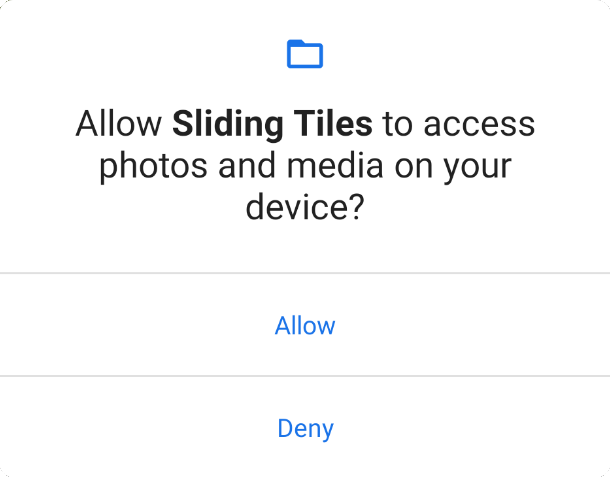
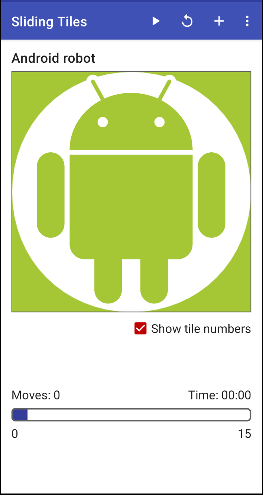
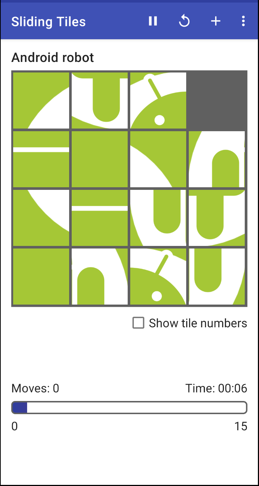
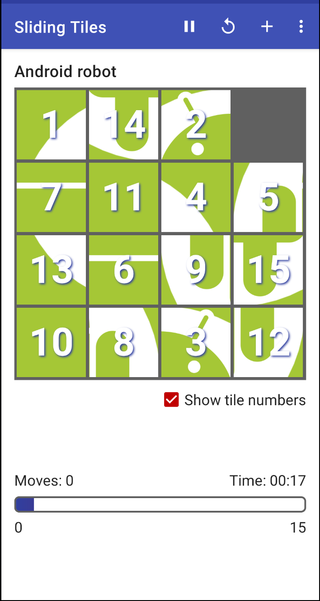
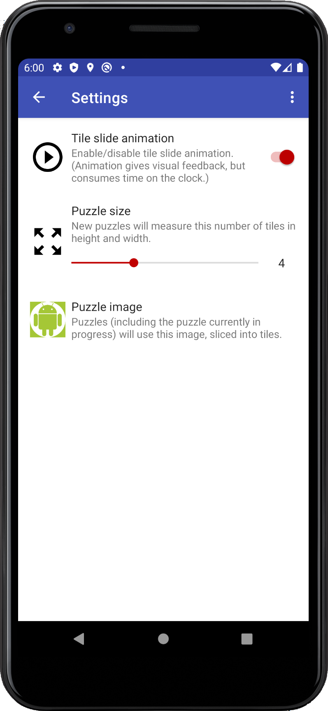
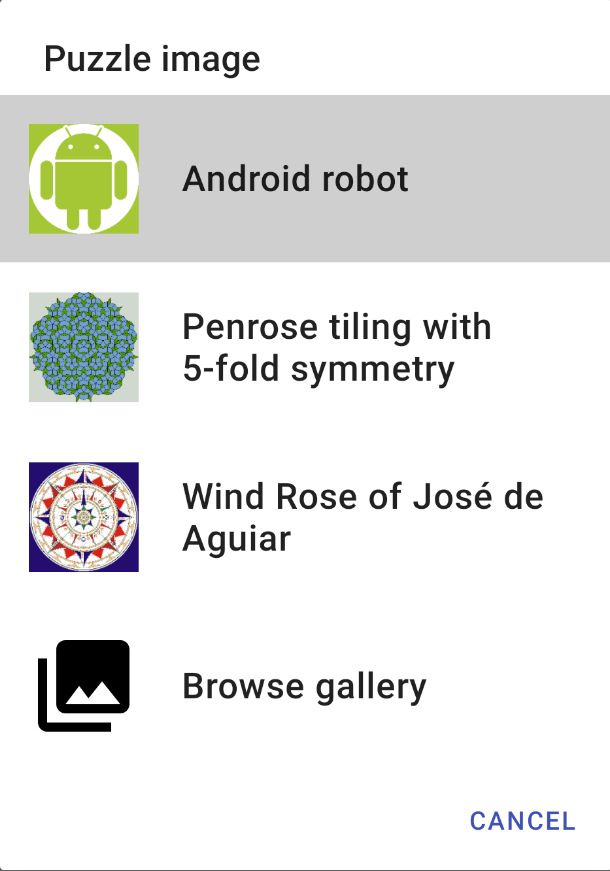

## Launch

* Start the app by launching the **Sliding Tiles** icon. 

* If this is the first time the app is launched after installation, a request for permission to access images on the device appears. Note that this access is not required to run the app; however, granting this access does allow you to select a puzzle image other than the 3 included with the app.  

## Play

* After the access permission request is accepted (or declined), the main screen of the app appears, with the puzzle image displayed. If this is the first time running the app after installation, a default image (one of the Android robot image variants) is used, with a puzzle size of 4x4.  

* Initially, the puzzle is _paused_, with the unscrambled image displayed. To start solving, click the &#x25b6; (_play_) icon in the action bar. This will display the scrambled puzzle. To pause the puzzle at any time, click the &#x23f8; (_pause_) icon in the action bar.
  
* To move a tile that's in the same row or column as the empty space, simply click on it; all of the tiles between the clicked tile and the empty space will slide over one position. (There's no need to drag the tiles to move them.) If you click on a tile that's not in the same row or column as the empty space, a message indicating that the tile you clicked can't be moved will appear briefly at the bottom of the screen.

* After any tile is moved, the move counter increases. If you click on a tile that causes multiple tiles to slide, the move counter will increase by the number of tiles moved.

* The timer updates automatically until the puzzle is solved.

* Use the **Show tile numbers** checkbox to show or hide the tile numbers. Showing tile numbers can make it easier to solve larger puzzles or puzzles with detailed images. 
 
* When the puzzle is solved, you'll see a message to that effect at the bottom of the screen. The entire unscrambled image will be displayed, without any separations between the tiles. No tiles may be moved in a solved puzzle.

* At any time, you may reset the puzzle to its original (scrambled) position by clicking the 
**&#x2b6f;** (_reset_) icon in the action bar.

* To start a new puzzle (with the current settings) in a new, scrambled configuration, click the &#x2795; (_new_) icon in the action bar.

## Settings  

To review or change app settings, select **Settings** from the options overflow menu (usually accessed by clicking the 3 vertical dots in the upper-right corner of the screen).

* Tile slide animation can be enabled or disabled with the **Tile slide animation** switch. Changing this settings takes effect immediately on returning to the puzzle screen.

* The **Puzzle size** slider can be set to 3, 4, 5, or 6, for a resulting size of 3x3, 4x4, 5x5, or 6x6 (respectively). Any changes to this setting take effect when the next new puzzle is created.

* Clicking **Puzzle image** displays a list of images, including the 3 images included with the app, along with the currently selected image (if it's not one of the default 3).
    
    If permission to access external images was previously granted, a **Browse gallery** option is displayed. After clicking this image, you'll be presented with a standard dialog for browsing and selecting the image files on the device. 
  
    Changing the selected image will take effect immediately on return to the puzzle screen.
    